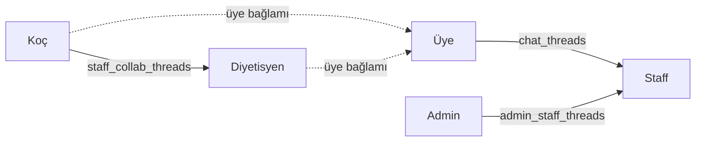

# Yeni Form Mobile — Mimari

> Kod haritası: [`CODEMAP.md`](./CODEMAP.md) · İlerleme: [`AI_MOBILE_PROGRESS.md`](./AI_MOBILE_PROGRESS.md)

---

## 1. Stack

| Katman | Seçim |
|--------|--------|
| Framework | Expo SDK **56** + Expo Router |
| UI | React Native 0.85 / React 19 |
| Backend | Aynı Supabase proje (web ile) |
| HTTP API | `EXPO_PUBLIC_SITE_URL` → `https://www.yeniform.com/api/*` |
| State | Tek `AppContext` (web AppContext parity hedefi) |
| Auth storage | SecureStore / AsyncStorage (remember-me) |
| Push | Expo Notifications (+ opsiyonel OneSignal App ID) |

---

## 2. Provider ağacı

```
RootLayout (app/_layout.tsx)
  └─ GestureHandlerRootView
       └─ SafeAreaProvider
            └─ ToastProvider
                 └─ AppProvider          ← auth + data + realtime + presence
                      └─ Stack / route groups
                           └─ (staff) StaffDashboardProvider  ← staff-only UI cache
```

---

## 3. Oturum tipleri

| `session.type` | Kim | Ana rota |
|----------------|-----|----------|
| `admin` | Admin e-posta / rol | `/(admin)` |
| `staff` | `staff` tablosu | `/(staff)` |
| `member` | `members` tablosu | `/(app)` |

Çözüm: `hydrateAuthState()` (`supabaseAuth.ts`) → `routeForRole()`.

---

## 4. Auth akışları

### E-posta / şifre
`login` / `register` → Supabase Auth → isteğe bağlı `/api/auth` signup → member row → `registerActiveSession`.

### Google OAuth
1. `oauthAuth.signInWithSocial('google')`
2. `Linking.createURL('auth/callback')` → `redirectTo`
3. `WebBrowser.openAuthSessionAsync`
4. Session URL’den → `establishAuthSessionFromUrl`
5. Allow-list yoksa website redirect → `redirectMisconfigured`

**Önemli:** `expo-auth-session` / native `ExpoCrypto` kullanılmıyor.

### Deep link callback
- Scheme: `yeniform` (`app.json`)
- Entry: `app/auth/callback.tsx` → `(auth)/callback.tsx`
- Desteklenen query: `flow`, `plan`, `evt`, `verify=email|phone`, `next=reset-password`

### E-posta / telefon doğrulama
- API: `POST /api/auth` (`email-send`, `email-confirm`)
- Profil alanları: `members.data.emailVerifiedAt`, `phoneVerifiedAt`
- UI: Profil → Ayarlar → `VerificationSection`
- SMS yoksa / `EXPO_PUBLIC_PHONE_VERIFY_VIA_EMAIL=true` → e-posta OTP fallback

### Single session
`singleSession.ts` — periyodik verify + AppState `active`.

---

## 5. Chat türleri



| Tür | Tablolar | Kim görür | Mobil UI |
|-----|----------|-----------|----------|
| Üye↔staff | `chat_*` | üye + atanmış staff | `(app)/messages`, `(staff)/messages` [Danışanlar] |
| Admin↔staff | `admin_staff_*` | admin + o staff | `(admin)/messages`, `(staff)/messages` [Admin] |
| Collab | `staff_collab_*` | koç + diyetisyen (ortak ücretli üye) | `(staff)/messages` [Ekip] |

Collab gönderiminde `contactInfoGuard` (telefon/e-posta/sosyal engeli).

---

## 6. Realtime + presence

### Presence
- `startPresenceTracker` → her 60s `pingPresence` → `user_presence`
- App foreground’da beat; unmount’ta `clearPresence`
- Rol: `session.type` çözülmeden yazılmaz (yanlış `member` rolü engeli)

### Realtime (`subscribeRealtimeSync`)
Abonelikler AppContext mount’unda; bağımlılıklar **primitive** (`sessionType`, `memberId`, `staffId`) — object referansına bağlanmaz (kanal thrash önlemi).

Message filtreleri: bilinen thread id set’leri (`chatThreadIdsRef`, `adminStaffThreadIdsRef`, `staffCollabThreadIdsRef`). Admin tüm admin-staff / collab mesajlarını alır.

---

## 7. Ortam değişkenleri

| Değişken | Zorunlu | Açıklama |
|----------|---------|----------|
| `EXPO_PUBLIC_SUPABASE_URL` | ✅ | Supabase URL |
| `EXPO_PUBLIC_SUPABASE_PUBLISHABLE_KEY` | ✅ | veya `ANON_KEY` |
| `EXPO_PUBLIC_SITE_URL` | ✅ | API tabanı (default yeniform.com) |
| `EXPO_PUBLIC_ADMIN_EMAIL` | hayır | default `admin@yeniform.com` |
| `EXPO_PUBLIC_TELEGRAM_NOTIFY_SECRET` | hayır | = Vercel `VITE_TELEGRAM_NOTIFY_SECRET` |
| `EXPO_PUBLIC_PHONE_VERIFY_VIA_EMAIL` | hayır | `true` → telefon doğrulamayı e-posta ile zorla |

Şablon: `.env.example`

---

## 8. Web ↔ mobil port sözleşmesi

1. Web’deki ilgili `*Db.js` / page davranışını oku.
2. Mobilde `src/services` (+ `db/`) altına aynı API yüzeyini taşı.
3. AppContext’e state/action ekle (web AppContext ile isim uyumu tercih et).
4. Expo Router ekranı ekle; guard unutma.
5. Realtime gerekiyorsa `realtimeSync.ts` + AppContext handler.
6. `AI_MOBILE_PROGRESS.md` + gerekirse `CODEMAP.md` güncelle.

**Yasak:** Blueprint / web’de olmayan iş kuralını uydurmak.

---

## 9. Eksikler (bilinçli)

| Alan | Durum |
|------|--------|
| Stripe Checkout (plan yükselt + ücretli kayıt) | ✅ Tur I — `stripePayment.ts`, Üyeliğim, onboarding |
| Ödeme geçmişi UI | Yok — web `PaymentManagementPage` |
| Admin tickets realtime UI | Realtime kanalı web’de var; mobil UI yok |
| Blueprint `08`–`20` ekran task list | Yok |
| `rn-migration` klasörü | Bazı makinelerde fiziksel olarak yok |

---

## 10. Çalıştırma / debug

```bash
npm run start:go          # Expo Go
npx expo start -c         # cache temiz
npm run build:dev:ios     # EAS development client (gerekirse)
```

`package.json` → `start` = `--dev-client`; Go için `start:go` kullan.
